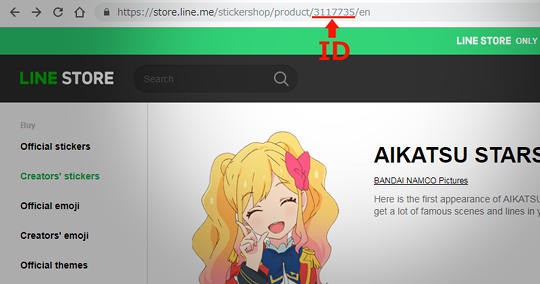

# Line Sticker Downloader

Download sample images and assets from the store

## Requirements

- PHP7 (CGI)
  - Zip

## Install

Download as zip and extract to any web directory

## Usage

1. Go to index.php
2. Fill ID
3. Click "Download" button
4. Wait
5. Click "Download" link

### Note

The document size of the download page would be huge because the PHP program outputs a lot of dammy data so that a server sends document data continuously and a browser refresh the screen.
